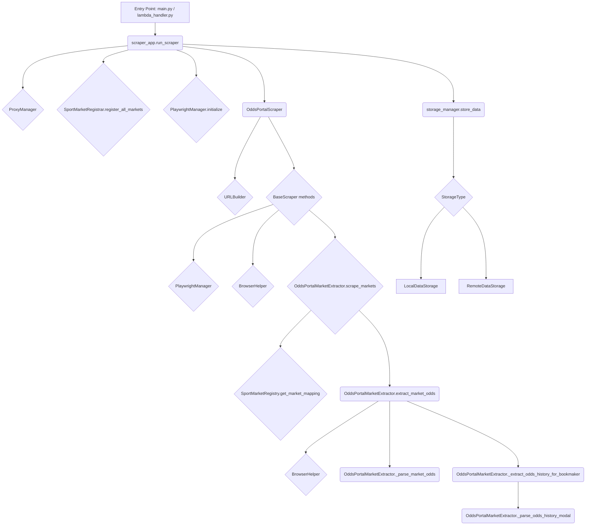

# Codebase Review: OddsHarvester

## Overall Architecture:

The application is designed as a web scraper focused on OddsPortal. It has distinct layers for:
*   **Entry Points:** CLI ([`src/main.py`](src/main.py)) and AWS Lambda ([`src/lambda_handler.py`](src/lambda_handler.py)).
*   **Orchestration:** [`src/core/scraper_app.py`](src/core/scraper_app.py) manages the overall scraping workflow, including retries and initialization of core components.
*   **Scraping Logic:**
    *   [`src/core/odds_portal_scraper.py`](src/core/odds_portal_scraper.py): Handles high-level navigation (historic, upcoming, specific matches) and pagination.
    *   [`src/core/base_scraper.py`](src/core/base_scraper.py): Contains common logic for extracting match details (from a JSON event header) and orchestrating concurrent odds extraction for multiple matches.
    *   [`src/core/odds_portal_market_extractor.py`](src/core/odds_portal_market_extractor.py): Focuses on extracting odds for specific betting markets, including handling odds history modals.
*   **Browser Management:**
    *   [`src/core/playwright_manager.py`](src/core/playwright_manager.py): Manages Playwright browser lifecycle.
    *   [`src/core/browser_helper.py`](src/core/browser_helper.py): Provides reusable browser interaction utilities (cookie dismissal, tab navigation, scrolling).
*   **Configuration & Definitions:**
    *   [`src/core/sport_market_registry.py`](src/core/sport_market_registry.py): Defines how different sports markets are scraped using a registry pattern.
    *   [`src/utils/sport_market_constants.py`](src/utils/sport_market_constants.py), [`src/utils/sport_league_constants.py`](src/utils/sport_league_constants.py), [`src/utils/command_enum.py`](src/utils/command_enum.py), [`src/utils/constants.py`](src/utils/constants.py): Centralized constants and enums.
*   **Data Storage:**
    *   [`src/storage/storage_manager.py`](src/storage/storage_manager.py): Facade for data storage.
    *   [`src/storage/local_data_storage.py`](src/storage/local_data_storage.py): Handles saving to local CSV/JSON.
    *   [`src/storage/remote_data_storage.py`](src/storage/remote_data_storage.py): Handles saving to S3 (via local JSON intermediate).
*   **Utilities:**
    *   [`src/utils/proxy_manager.py`](src/utils/proxy_manager.py): Manages proxy parsing and rotation.
    *   [`src/cli/`](src/cli/): Modules for CLI argument parsing and validation.

## Diagram of Core Scraping Flow:

## Strengths:

1.  **Clear Separation of Concerns:** The project is well-modularized. For example, Playwright management, browser interactions, market-specific extraction, and data storage are handled by distinct classes/modules. This generally improves maintainability and testability.
2.  **Asynchronous Operations:** The use of `asyncio` and `async/await` throughout the scraping process is crucial for I/O-bound tasks like web requests and browser interactions, leading to better performance.
3.  **Robust Retry Mechanism:** The `retry_scrape` function in [`scraper_app.py`](src/core/scraper_app.py:155) with a defined list of `TRANSIENT_ERRORS` is a good practice for handling common network issues in web scraping.
4.  **Configuration-Driven Market Scraping:** The [`SportMarketRegistry`](src/core/sport_market_registry.py:8) provides an extensible way to define and add support for new sports and markets without significantly altering core scraping logic.
5.  **Detailed Logging:** Consistent use of `logging` throughout the modules helps in debugging and monitoring. Different log levels seem to be used appropriately.
6.  **Helper Classes for Abstraction:** Classes like [`PlaywrightManager`](src/core/playwright_manager.py:7) and [`BrowserHelper`](src/core/browser_helper.py:4) abstract away common boilerplate and complex interactions, making the main scraper logic cleaner.
7.  **Proxy Management:** Basic proxy parsing and rotation are implemented in [`ProxyManager`](src/utils/proxy_manager.py:4).
8.  **Flexible Storage Options:** The `StorageManager` allows easy switching between local (CSV/JSON) and remote (S3) storage. The local CSV storage's ability to merge headers is a nice touch.
9.  **Handling of Dynamic Content:** Methods like `scroll_until_loaded` and `scroll_until_visible_and_click_parent` in [`BrowserHelper`](src/core/browser_helper.py:4) show an awareness of challenges with modern web pages.
10. **Timezone Handling:** Explicit handling of timezone conversions (UTC to Edmonton) using `ZoneInfo` with fallbacks is good, especially for date-sensitive data like match times.
11. **Docker Awareness:** The [`PlaywrightManager`](src/core/playwright_manager.py:38) checks if it's running in Docker to use appropriate browser arguments.

## Potential Weaknesses / Areas for Improvement:

1.  **Error Handling Granularity in Market Extraction:** While [`scraper_app.py`](src/core/scraper_app.py:155) has a good retry mechanism for the overall scraping function call, errors within `OddsPortalMarketExtractor.scrape_markets()` for individual markets seem to log the error and return `None` for that market ([`src/core/odds_portal_market_extractor.py:64-66`](src/core/odds_portal_market_extractor.py:64-66)). Depending on requirements, more specific retries or error handling at the individual market level might be beneficial.
2.  **Concurrency in `_collect_match_links`:** In [`OddsPortalScraper._collect_match_links()`](src/core/odds_portal_scraper.py:203), new pages (tabs) are created and processed sequentially within the loop (`await tab.goto(...)`). This could be a bottleneck for historical data scraping with many pages. Consider using `asyncio.gather` for concurrent page processing here, similar to how `extract_match_odds` handles concurrent match scraping.
3.  **Hardcoded Selectors:** Many CSS selectors are hardcoded as strings within methods (e.g., in [`BrowserHelper`](src/core/browser_helper.py) and [`OddsPortalMarketExtractor`](src/core/odds_portal_market_extractor.py)). While common, this makes the scraper brittle to website structure changes. Centralizing these in a constants file or a dedicated selectors module could improve maintainability.
4.  **Odds History Extraction Robustness:** The [`_extract_odds_history_for_bookmaker()`](src/core/odds_portal_market_extractor.py:214) method relies on hovering to trigger modals. This can sometimes be flaky. It also iterates through *all* odds blocks on the page for *each* bookmaker it wants to get history for, which might be inefficient if there are many odds blocks per bookmaker. The `await page.wait_for_timeout(2000)` after hover is a fixed delay, which might not always be optimal.
5.  **Proxy Rotation Strategy:** The [`ProxyManager`](src/utils/proxy_manager.py:80) implements a simple round-robin rotation. The rotation is called explicitly (it seems, though I haven't seen the call site for `rotate_proxy`). A more advanced strategy might involve rotating on specific errors or after a certain number of requests per proxy. The `scraper_app.py` retry logic doesn't explicitly show integration with proxy rotation on failure.
6.  **Remote Storage Intermediate File:** [`RemoteDataStorage`](src/storage/remote_data_storage.py:78) saves data to a local JSON file first, then uploads it. For very large datasets or in environments with limited local disk (like some Lambda configurations), streaming directly to S3 might be more efficient, though more complex to implement.
7.  **Lambda Handler Hardcoding:** The [`lambda_handler.py`](src/lambda_handler.py:12) has a `TODO` for parsing event parameters and currently uses hardcoded values for `run_scraper`. This needs to be implemented for a functional Lambda deployment.
8.  **Game Type Determination Complexity:** The [`_determine_game_type`](src/core/base_scraper.py:35) method in `BaseScraper` is quite long and has many conditional checks. While it appears thorough, it could become complex to maintain. Simplifying or structuring this logic further (e.g., using a more pattern-based approach or a small state machine if applicable) might be beneficial.
9.  **Lack of Unit/Integration Tests (Assumption):** The `tests/` directory exists, but the extent and coverage of tests are unknown. Comprehensive tests are crucial for a complex system like this, especially given its reliance on external website structures.